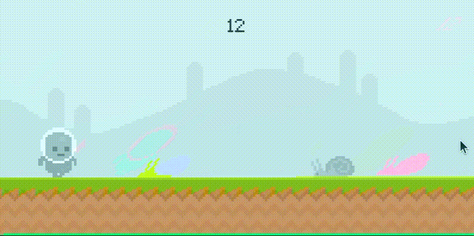
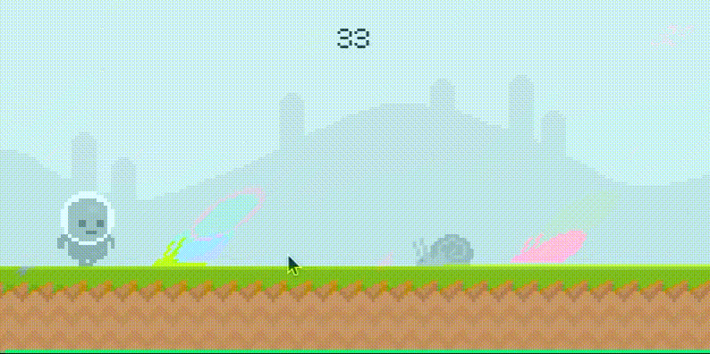

# Pixel Runner

A code along from the nice [pygame tutorial](https://youtu.be/AY9MnQ4x3zk) by code center.

Some minor gameplay adjustments are made.

## Double Jump!

Jumped too early? No worries. You can jump in air again.

## Snails cannot jump right?

Well this ones can. A well-placed mouse click can prod the snail to jump high up in the air and catch the player off
guard.

## Minor Fixes

- Refactored code to different object classes for better readability
- Fixed paths to images which had case issues
- Slight delay after end so that mashing the space button does not restart game immediately
